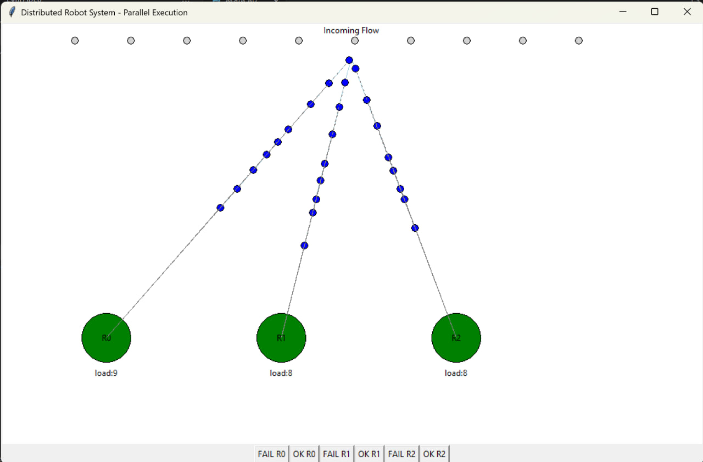
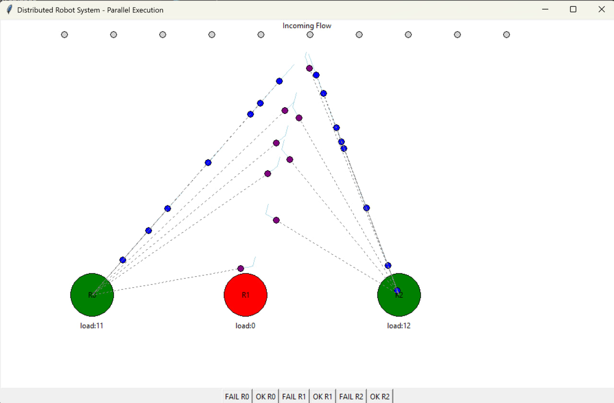
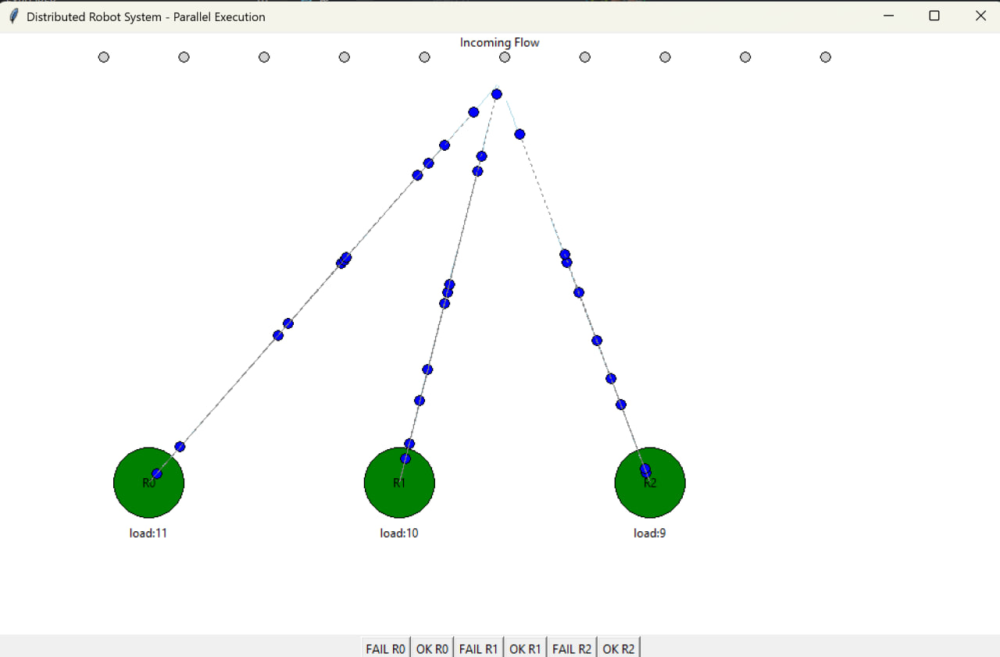

# Distributed-robots
Децентрализованная отказоустойчивая система кооперации манипуляторов с  распределением задач и обнаружением отказов

В начале демонстрации наша система работала с тремя каналами обслуживания 

 

Далее один из каналов обслуживания вышел из строя, система распределила заявки обслуживания по двум оставшимся в рабочем состоянии каналам

 

Затем ранее вышедший из строя канал был возвращен в систему и заявки продолжили идти по трем каналам обслуживания, как и было в начале демонстрации 

 
